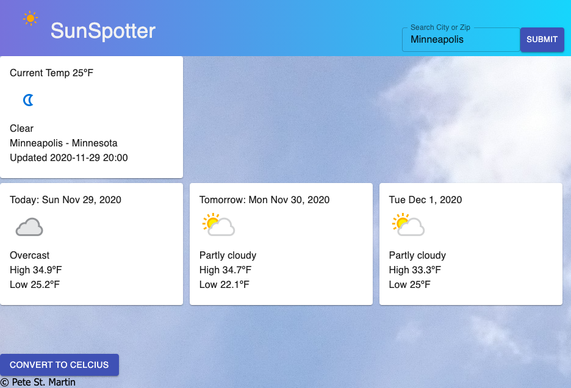

# SunSpotter - Current and Future Weather Forecast

SunSpotter is a weather app to find current weather conditions as well as a three-day forecast (today, tomorrow, and two days away). Simply enter a city or zip code from anywhere in the world and SunSpotter will display your data.  SunSpotter is mobile responsive and will look great on your desktop or mobile device.

## Built With

This version uses React, Redux, Express, Passport, and PostgreSQL.  
Additional Technologies listed below (see "Additional Technologies Used"), and a full list of dependencies can be found in `package.json`.

## Getting Started

### Prerequisites

Before you get started, make sure you have the following software installed on your computer:

- [Node.js](https://nodejs.org/en/)
- [PostrgeSQL](https://www.postgresql.org/)
- [Nodemon](https://nodemon.io/)

### API Key

SunSpotter uses the API from Weather API.  

Sign up for an API Key at: [weatherapi.com](https://www.weatherapi.com/)

See "Installation Instructions" below for information on setting your API Key.


### Installation Instructions

* Run `npm install`
* Create a `.env` file at the root of the project and paste these two lines into the file:
    ```
    WEATHER_API_KEY={insert API Key}
    SERVER_SESSION_SECRET=superDuperSecret
    
    ```
    While you're in your new `.env` file, replace {insert API Key} with the API Key you received from weatherapi.com (see "API Key" if you do not have an API Key).  Also, take the time to replace `superDuperSecret` with some long random string like `25POUbVtx6RKVNWszd9ERB9Bb6` to keep the application secure. Here's a site that can help you: [https://passwordsgenerator.net/](https://passwordsgenerator.net/). You will receive a warning if you create a secret with less than eight characters or leave it as `superDuperSecret`.
* Run `npm run server`
* Run `npm run client`
* Navigate to `localhost:3000`

### Screen Shot



## Production Build

Before pushing to Heroku, run `npm run build` in terminal. This will create a build folder that contains the code Heroku will be pointed at. You can test this build by typing `npm start`. Keep in mind that `npm start` will let you preview the production build but will **not** auto update.

* Run `npm start`
* Navigate to `localhost:5000`

## Lay of the Land

* `src/` contains the React application
* `public/` contains static assets for the client-side
* `build/` after you build the project, contains the transpiled code from `src/` and `public/` that will be viewed on the production site
* `server/` contains the Express App

## Additional Technologies Used
* HTML5
* CSS
* React.js
* React-Redux
* Redux-Saga
* Node.js
* Express
* Axios
* Material UI
* SweetAlert
* API from weatherapi.com (for weather data)

### Authors
Pete St. Martin

